# Fauna API usage

## Operational definitions

### GraphQL

* **schema** = GraphQL schema definition
* **query** = a read only fetch operation
* **mutation** = a write followed by fetch operation
* **[resolver](https://graphql.org/learn/execution/#root-fields-resolvers)** = function provided by GraphQL server as the implementation for a graphql query/mutation
* **[arguments](https://graphql.org/learn/queries/#arguments)** = the query/mutation parameters
* **[variables](https://graphql.org/learn/queries/#variables)** = dynamic values out of the query passed as a separate dictionary(json) (the arguments to fields are dynamic)

### Fauna

* **[fql](https://docs.fauna.com/fauna/current/api/fql/)** = fauna query language
* **[udf](https://docs.fauna.com/fauna/current/api/graphql/functions)** = user defined function (fql lambda functions)

## GraphQL vs FQL in Fauna

Fauna provides **2 APIs** for manipulating the data from Fauna databases

* **FQL** code to write and execute in **Fauna Shell** from **Fauna Dashboard** or in local Fauna Shell installed
* **GraphQL** queries and mutations to write and execute in **GraphQL Playground** from **Fauna Dashboard** or sending them over the network using HTTP requests

## Create database in Fauna

The **database** can be created in **Fauna Dahsboard** or in **Fauna shell**.

=> [**Fauna guide**](https://docs.fauna.com/fauna/current/learn/quick_start/gql_quick_start)

The database collections can be created manually in **Fauna Dashboard**, in **Fauna shell** or by importing the **GraphQL schema**.

By importing the schema, Fauna will take care of creating the underling collections, indexes, and relationships.

The **auto-generated API documentation** can be seen  in the **GraphQL Playground** using the **Docs and Schema tabs**.

**Graphql schema definition file**

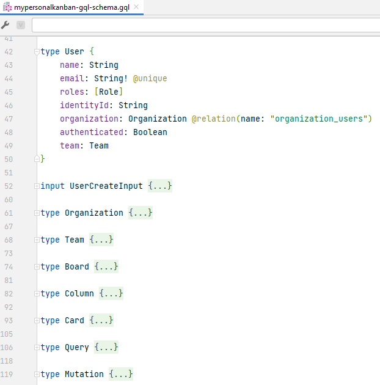

The **GraphQL schema can be imported in Fauna** either

* from **GraphQL playground** by importing the gql file containing the schema
  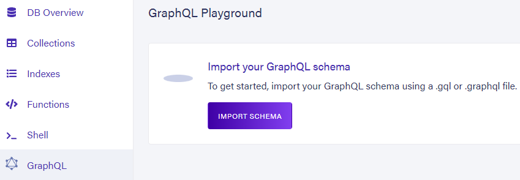
* or by sending a **HTTP request** on *POST /import* endpoint with the gql file containing the schema in the request body 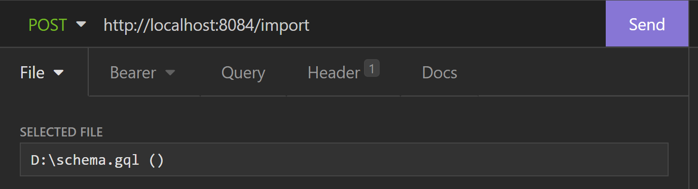
  
  ## GraphQL API in Fauna
  
  **Graphql schema definition file** contains:
  
  * **[types](https://graphql.org/learn/schema/#type-language)** = object types (object type to fetch) or query and mutation types (to declare custom queries and mutations)
  * **[inputs ](https://graphql.org/learn/schema/#input-types)**= input object types used in customned mutations

**Examples**: Operations on User collection

* **Query**: Fetch all users
  
  * **Fauna PlayGround**
    
    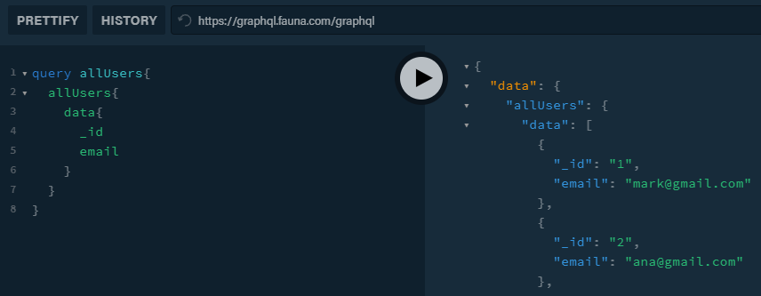
  * **HTTP Client**
    
    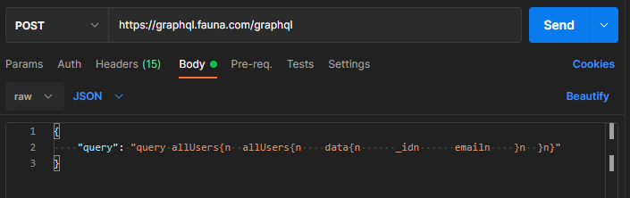
* **Mutation**: Create user (using variables)
  
  * **Fauna Playground**
    
    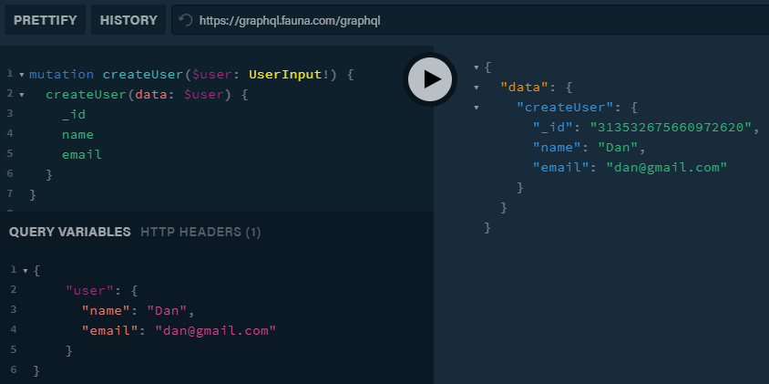
  * **HTTP Client**
    
    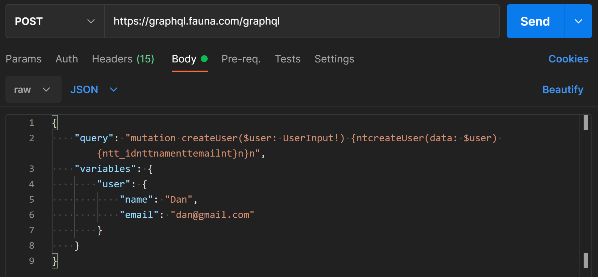
* **Custom mutation**: Create multiple users (variables: array of users)
  
  * Adding the **mutation type** (***createUsers***) and **input type **for this mutation (***UserCreateInput***) in the gql schema and **updating the schema in the GraphQL Playground**
    
    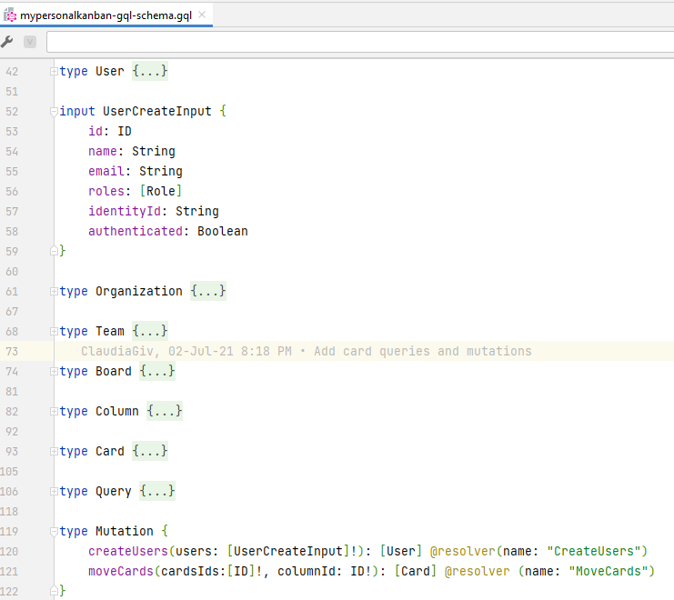
  * **Adding the resolver** for the custom mutation by creating a **UDF **in Fauna using **FQL**
    
    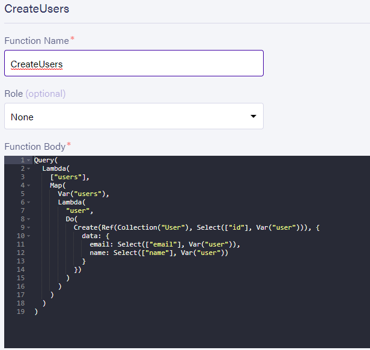
  * **Fauna Playground**
    
    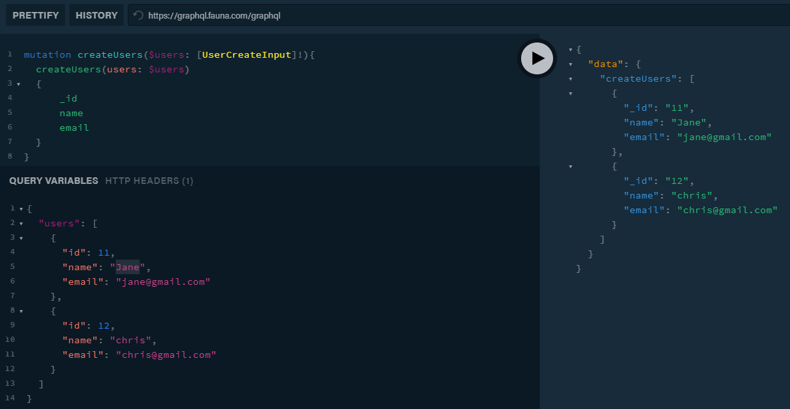
  * **HTTP Client**
  
    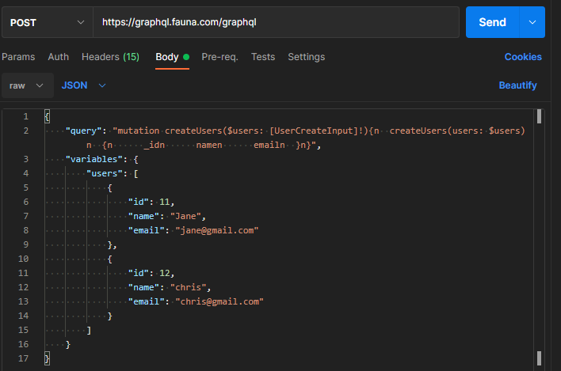

